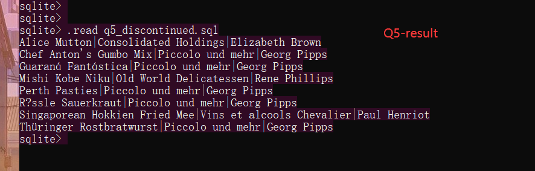

## 2022年秋季 SCU DataBase 作业
   

### author：**闫创业**
### 学号：2019141410115
### 任课老师：杨宁
 

### 第一次作业结果展示
### **Q1-result**

### **Q2-result**

### **Q3-result**\

### **Q4-result**

### **Q5-result**

### **Q6-result**

### **Q7-result**

### **Q8-result**

### **Q9-result**
