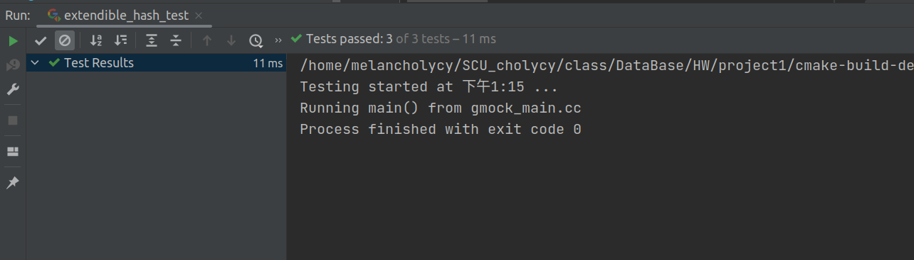
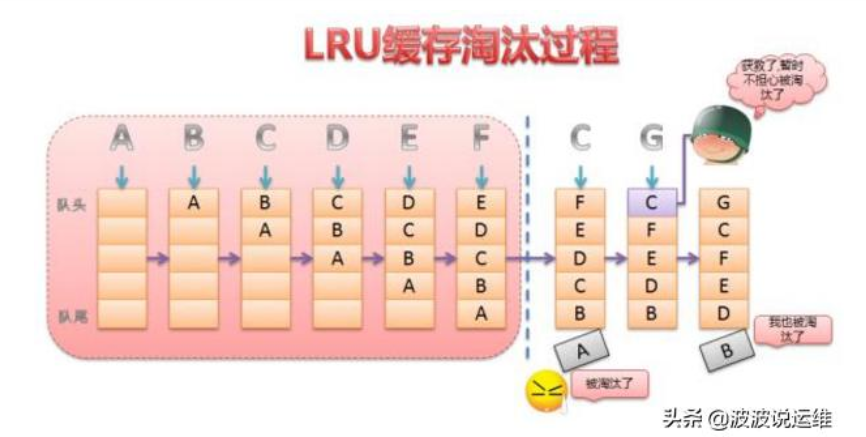
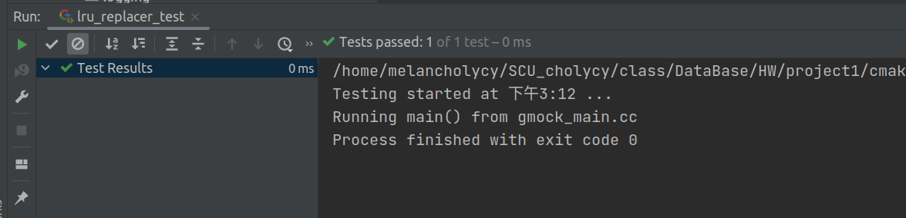
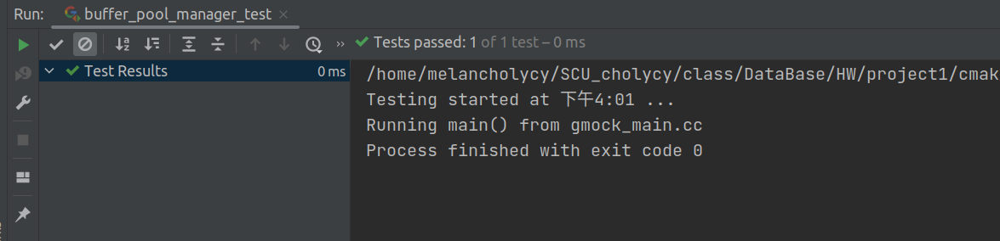

# Chuangye Yan's ReadME
## Test result
### Task1


### Task2
LRU(Least recently used)算法原理的基本概念
是当内存的剩余的可用空间不够时,缓冲区尽可能的先保留使用者最常使用的数据,换句话说就是优先清除”较不常使用的数据”,并释放其空间.之所以”较不常使用的数据”要用引号是因为这里判断所谓的较不常使用的标准是人为的、不严格的   
LRU淘汰过程原理如下图所示：


<br>

Task2-testResult


### Task3-Result



# ------------------cutting line---------------
## origin README
# SCU Database Systems
# SQLite Project Source Code

### Build
```
mkdir build
cd build
cmake ..
make
```
Debug mode:

```
cmake -DCMAKE_BUILD_TYPE=Debug ..
make
```

### Testing
```
cd build
make check
```

### Run virtual table extension in SQLite
Start SQLite with:
```
cd build
./bin/sqlite3
```

In SQLite, load virtual table extension with:

```
.load ./lib/libvtable.dylib
```
or load `libvtable.so` (Linux), `libvtable.dll` (Windows)

Create virtual table:  
1.The first input parameter defines the virtual table schema. Please follow the format of (column_name [space] column_type) seperated by comma. We only support basic data types including INTEGER, BIGINT, SMALLINT, BOOLEAN, DECIMAL and VARCHAR.  
2.The second parameter define the index schema. Please follow the format of (index_name [space] indexed_column_names) seperated by comma.
```
sqlite> CREATE VIRTUAL TABLE foo USING vtable('a int, b varchar(13)','foo_pk a')
```

After creating virtual table:  
Type in any sql statements as you want.
```
sqlite> INSERT INTO foo values(1,'hello');
sqlite> SELECT * FROM foo ORDER BY a;
a           b         
----------  ----------
1           hello   
```
See [Run-Time Loadable Extensions](https://sqlite.org/loadext.html) and [CREATE VIRTUAL TABLE](https://sqlite.org/lang_createvtab.html) for further information.

### Virtual table API
https://sqlite.org/vtab.html

### TODO
* update: when size exceed that page, table heap returns false and delete/insert tuple (rid will change and need to delete/insert from index)
* delete empty page from table heap when delete tuple
* implement delete table, with empty page bitmap in disk manager (how to persistent?)
* index: unique/dup key, variable key
