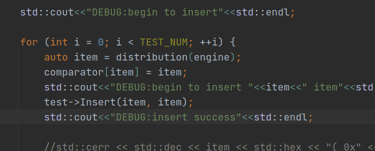
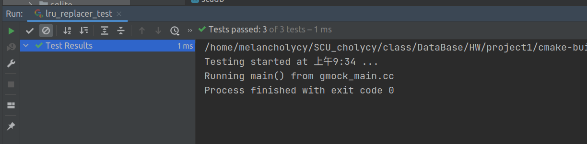

# Chuangye Yan's ReadME
## Test result
## 以下是工程原版的test结果
### Task1-result


### Task2
LRU(Least recently used)算法原理的基本概念
是当内存的剩余的可用空间不够时,缓冲区尽可能的先保留使用者最常使用的数据,换句话说就是优先清除”较不常使用的数据”,并释放其空间.之所以”较不常使用的数据”要用引号是因为这里判断所谓的较不常使用的标准是人为的、不严格的   
LRU淘汰过程原理如下图所示：


<br>

### Task2-result


### Task3-result


## 以下是老师发的答案中的test测试结果
### Test1 result - projectSol's newTest

---
直接使用原版，copy过来会进行这个报错，如下图所示：

---
因此尝试再去检查了下写的extend-hash类代码，但是没有发现什么逻辑上的问
题，因此转而怀疑test代码是不是有问题，采取一个一个TEST进行测试，发现8个
test中除了BasicRandomTest都能跑通，因此之前出现错误的原因是进行BasicRandomTest
时引起系统中断导致程序终止，才导致后续能测试成功的也无法成功。

---
将BasicRandomTest放在最后,并添加交互DEBUG语句.  
交互的代码如下所示：  


<br>

debug结果为：

通过上述debug信息可以得出是hash表的insert失败了，但是在其他测试中都没有失败，因此猜想是类实例化失败，参考其他测试代码，
修改实例化构造方式，代码如下所示：
```cpp
//调用有参构造函数
    TEST(ExtendibleHashTest, BasicRandomTest) {
        ExtendibleHash<int, int> *test = new ExtendibleHash<int, int>(2);
```

---
最终顺利通过测试


### Test2 result - projectSol's newTest


### Test3 result - projectSol's newTest


# ------------------cutting line---------------
## origin README
# SCU Database Systems
# SQLite Project Source Code

### Build
```
mkdir build
cd build
cmake ..
make
```
Debug mode:

```
cmake -DCMAKE_BUILD_TYPE=Debug ..
make
```

### Testing
```
cd build
make check
```

### Run virtual table extension in SQLite
Start SQLite with:
```
cd build
./bin/sqlite3
```

In SQLite, load virtual table extension with:

```
.load ./lib/libvtable.dylib
```
or load `libvtable.so` (Linux), `libvtable.dll` (Windows)

Create virtual table:  
1.The first input parameter defines the virtual table schema. Please follow the format of (column_name [space] column_type) seperated by comma. We only support basic data types including INTEGER, BIGINT, SMALLINT, BOOLEAN, DECIMAL and VARCHAR.  
2.The second parameter define the index schema. Please follow the format of (index_name [space] indexed_column_names) seperated by comma.
```
sqlite> CREATE VIRTUAL TABLE foo USING vtable('a int, b varchar(13)','foo_pk a')
```

After creating virtual table:  
Type in any sql statements as you want.
```
sqlite> INSERT INTO foo values(1,'hello');
sqlite> SELECT * FROM foo ORDER BY a;
a           b         
----------  ----------
1           hello   
```
See [Run-Time Loadable Extensions](https://sqlite.org/loadext.html) and [CREATE VIRTUAL TABLE](https://sqlite.org/lang_createvtab.html) for further information.

### Virtual table API
https://sqlite.org/vtab.html

### TODO
* update: when size exceed that page, table heap returns false and delete/insert tuple (rid will change and need to delete/insert from index)
* delete empty page from table heap when delete tuple
* implement delete table, with empty page bitmap in disk manager (how to persistent?)
* index: unique/dup key, variable key
