# 1. Project2-B+Tree
延续使用上一次完成的工程  
**测试结果截图如下**  
## 1.1. **b_plus_tree_page_test**
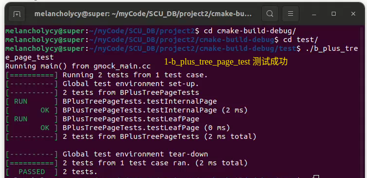

## 1.2. **b_plus_tree_insert_test**
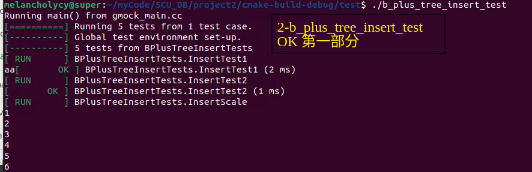
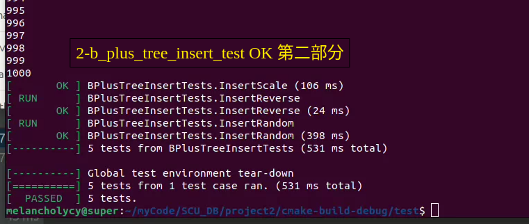

## 1.3. **b_plus_tree_delete_test**
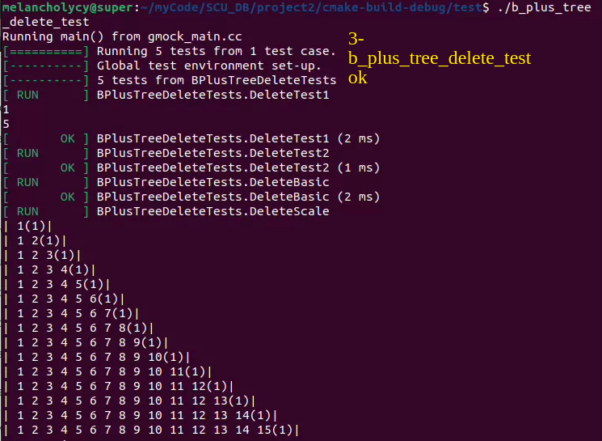
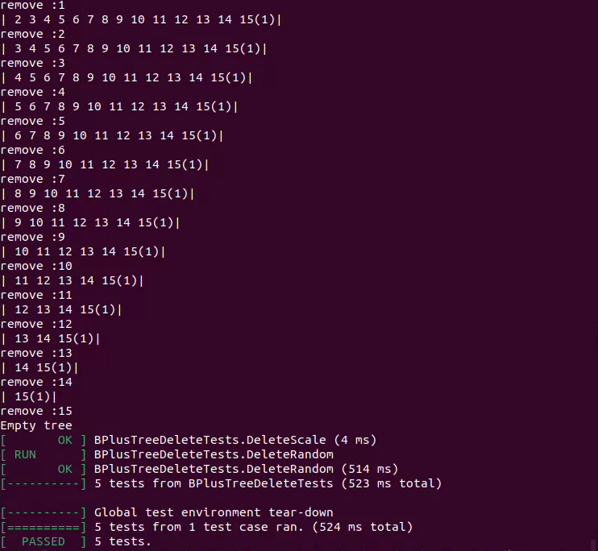

## 1.4. **b_plus_tree_test**
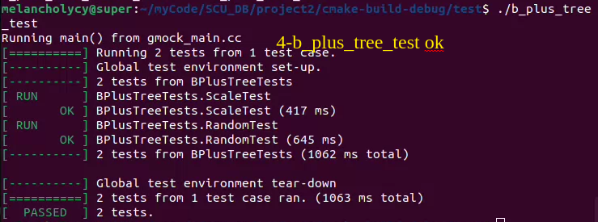

## 1.5. **b_plus_tree_print_test**
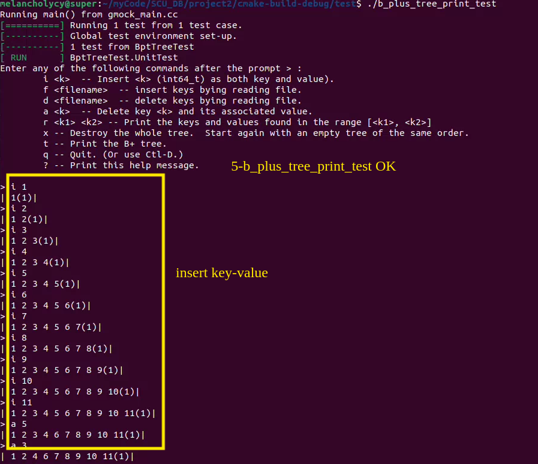
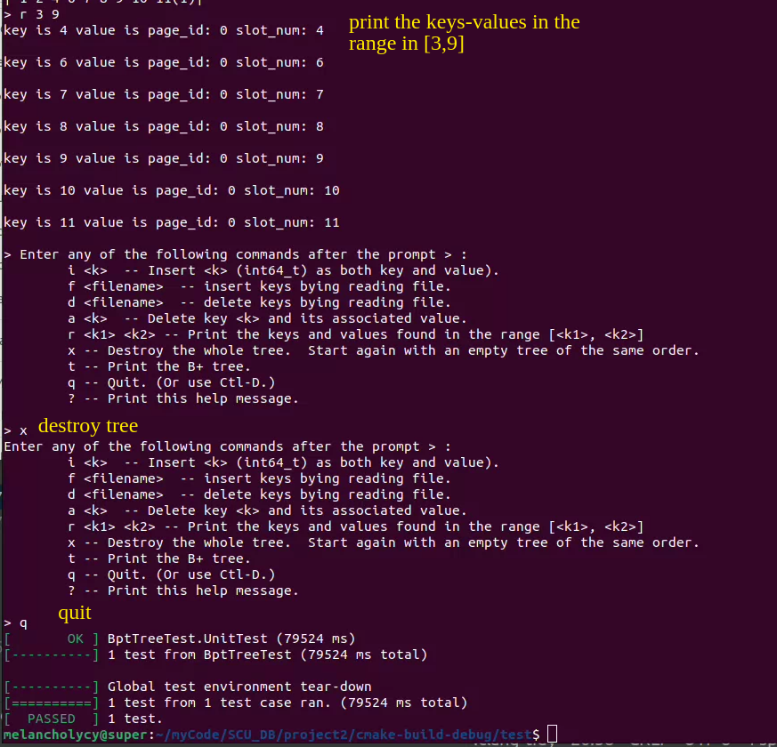

## 1.6. **b_plus_tree_concurrent_test**
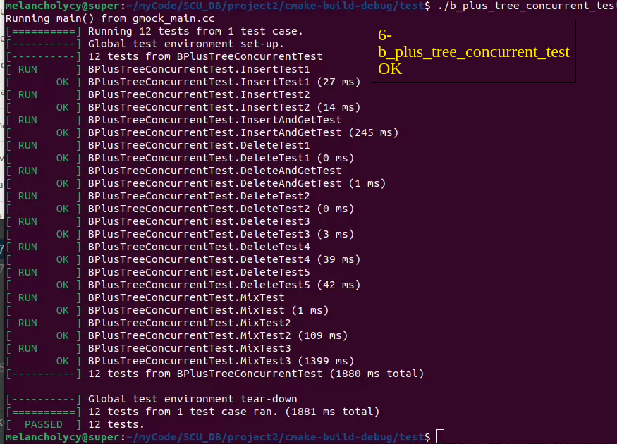

# 2. 问题解决
## 2.1. memmove报错问题
因为使用memmove拷贝内存，但是不是很规范
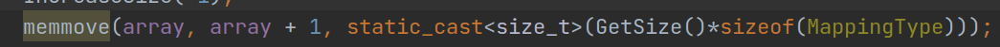    
会出现下面的error:
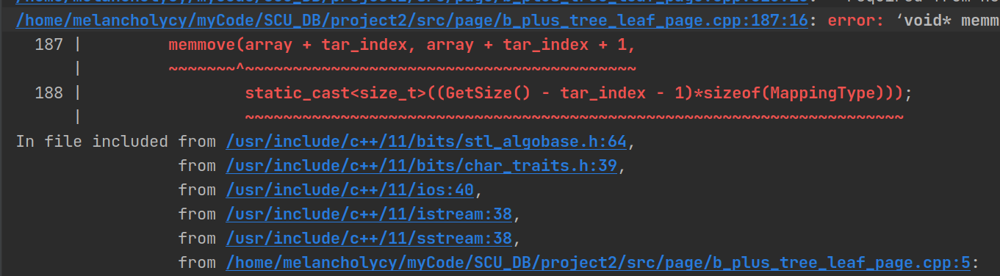
查阅资料之后发现问题不大，只是warning,因此直接在cmakelist中进行屏蔽掉  
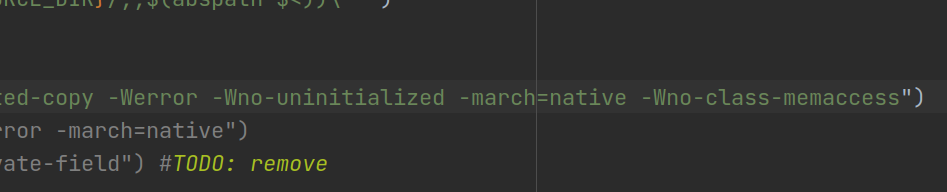

# 3. B+树基本原理
## 3.1. B+树定义
B+树基本架构为多叉树，在此基础上每个节点上不只是存储一个数据，而是多条记录，每个记录都是一个`std::pair`类型的键值对。一般采取维基百科上所定义的方式，即关键字个数比孩子结点个数小1。基本结构如下图所示:    
  
除此之外还有一些额外要求:
- B+树包含两种类型节点:**内部节点**和**叶子节点**，根节点取两者其一，且其关键字个数最少可以只有一个
- B+树**内部结点**仅用于索引，**叶子节点**存储数据
- m阶B+树的内部节点最多有m-1关键字，叶子节点最多存储m-1条记录
- 内部节点key按升序排列

## 3.2. B+**树插入操作**
1）树为空，创建一叶结点，插入记录，结束。

2）针对叶子类型结点：根据key值找到叶子结点，向这个叶子结点插入记录。插入后，若当前结点key的个数小于等于m-1，则插入结束。否则将这个叶子结点分裂成左右两个叶子结点，左叶子结点包含前m/2个记录，右结点包含剩下的记录，将第m/2+1个记录的key进位到父结点中（父结点一定是索引类型结点），进位到父结点的key左孩子指针向左结点,右孩子指针向右结点。将当前结点的指针指向父结点，然后执行第3步。

3）针对索引类型结点：若当前结点key的个数小于等于m-1，则插入结束。否则，将这个索引类型结点分裂成两个索引结点，左索引结点包含前(m-1)/2个key，右结点包含m-(m-1)/2个key，将第m/2个key进位到父结点中，进位到父结点的key左孩子指向左结点, 进位到父结点的key右孩子指向右结点。将当前结点的指针指向父结点，然后重复第3步。

## 3.3. B+**树删除操作**
如果叶子结点中没有相应的key，则删除失败。否则执行下面的步骤

1）删除叶子结点中对应的key。删除后若结点的key的个数大于等于Math.ceil(m-1)/2 – 1，删除操作结束,否则执行第2步。

2）若兄弟结点key有富余（大于Math.ceil(m-1)/2 – 1），向兄弟结点借一个记录，同时用借到的key替换父结（指当前结点和兄弟结点共同的父结点）点中的key，删除结束。否则执行第3步。

3）若兄弟结点中没有富余的key,则当前结点和兄弟结点合并成一个新的叶子结点，并删除父结点中的key（父结点中的这个key两边的孩子指针就变成了一个指针，正好指向这个新的叶子结点），将当前结点指向父结点（必为索引结点），执行第4步（第4步以后的操作和B树就完全一样了，主要是为了更新索引结点）。

4）若索引结点的key的个数大于等于Math.ceil(m-1)/2 – 1，则删除操作结束。否则执行第5步

5）若兄弟结点有富余，父结点key下移，兄弟结点key上移，删除结束。否则执行第6步

6）当前结点和兄弟结点及父结点下移key合并成一个新的结点。将当前结点指向父结点，重复第4步。

